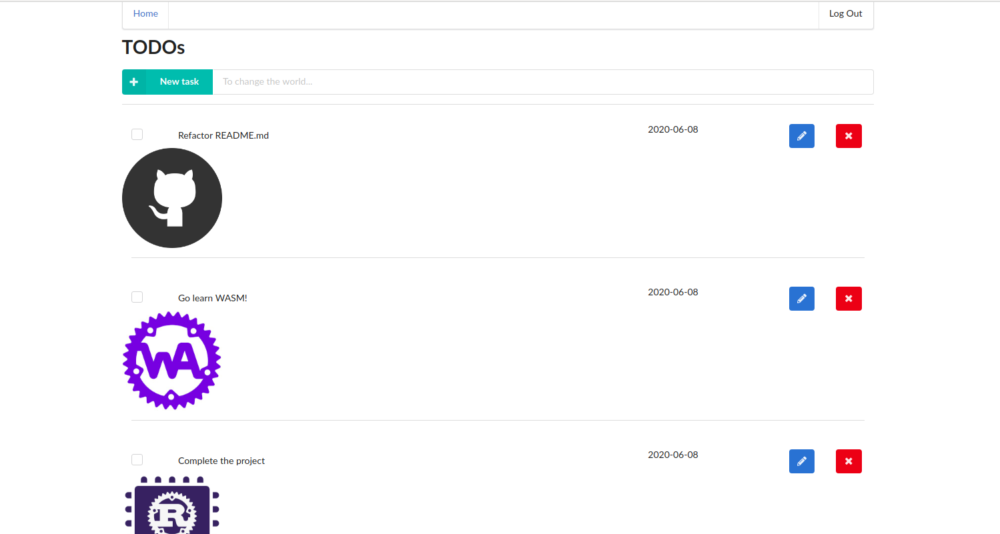
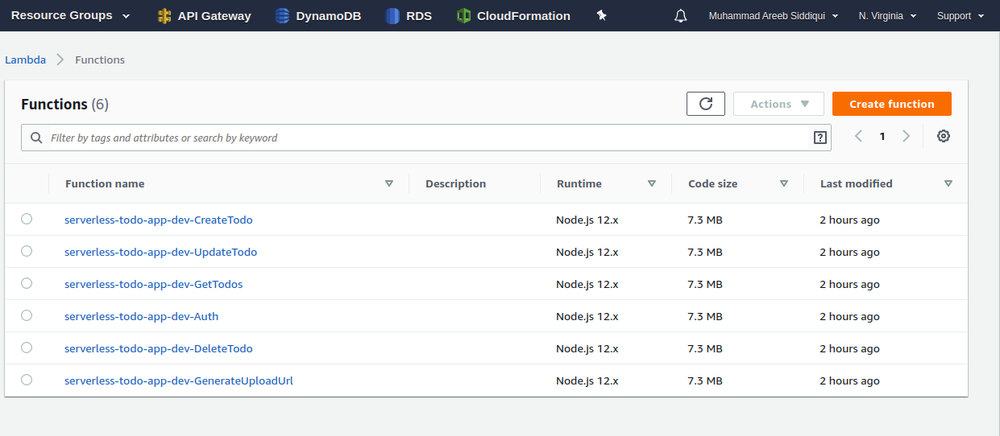
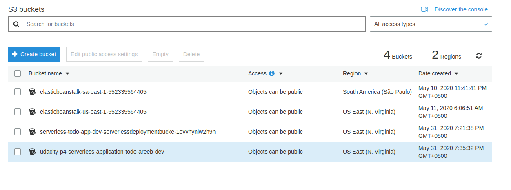
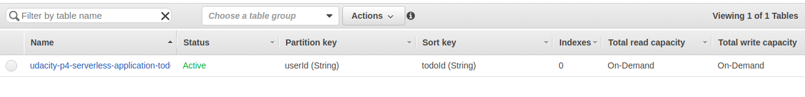
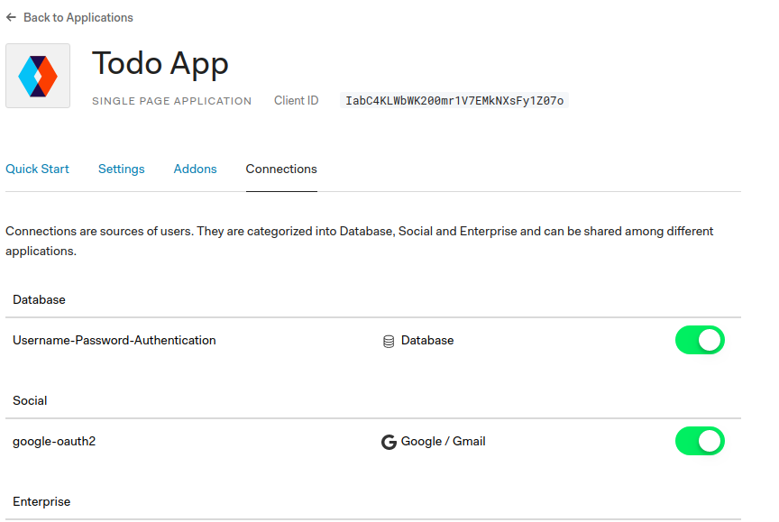

# Serverless Todo

This is a project from Cloud developer Nano Degree Udacity.
This app is todo with front end written in react and backend in typescript, the app is deployed on aws using Aws lambda and serverless framework.

## Tech Stack 
AWS | Serverless Framework | DynamoDB | S3 | AWS Lambda | OAuth | Cloudformation

## SCREENSHOTS

## Application Screen Shot

## AWS Lambda Handler

## S3 Bucket

## DynamoDB Table

## OAuth-Google

